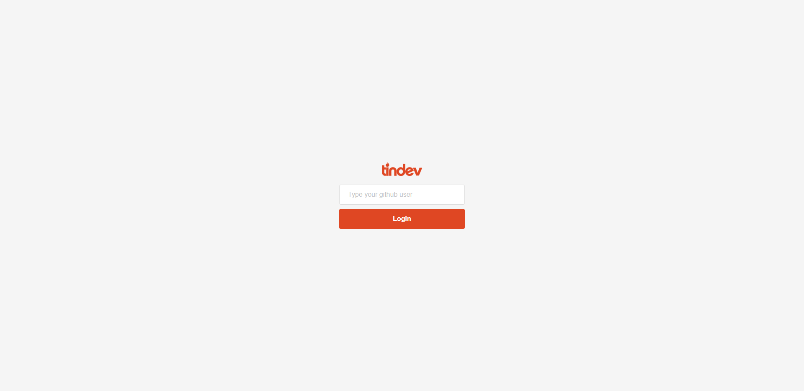
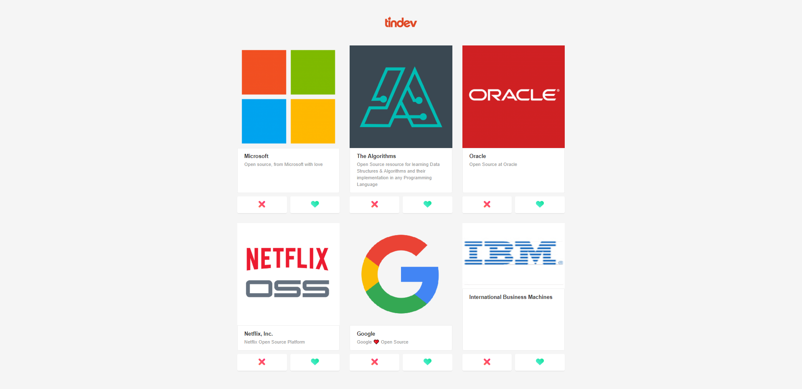
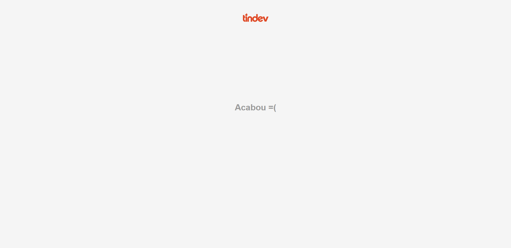

# Tindev

## Backend
- ### Axios ( API )
- ### MongoDB Atlas ( Database )
- ### Express ( Server )

## FrontEnd
- ### React
- ### CSS
- ### Axios ( Communication between backend and frontend )
- ### Socket-io ( Realtime )
  
## Mobile
- ### React-Native ( Multi Platform )

## IMAGES

